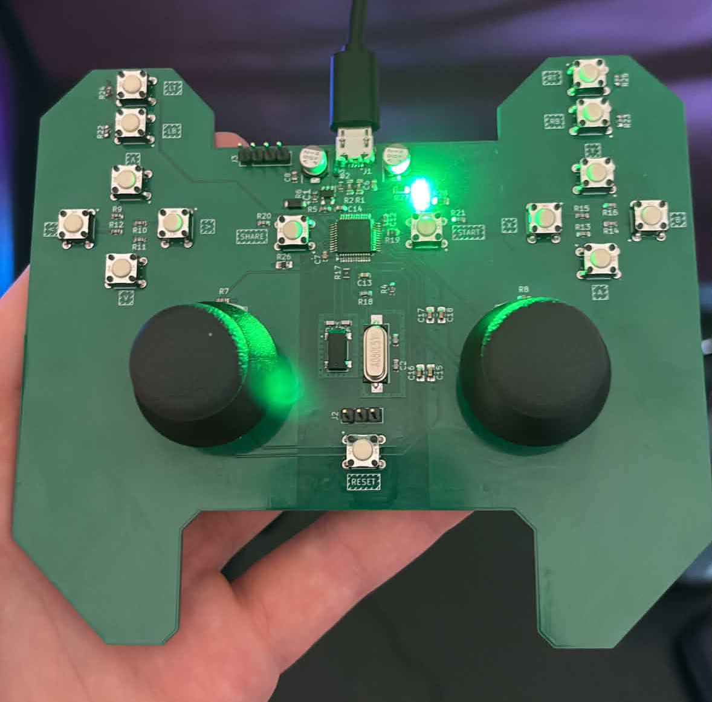
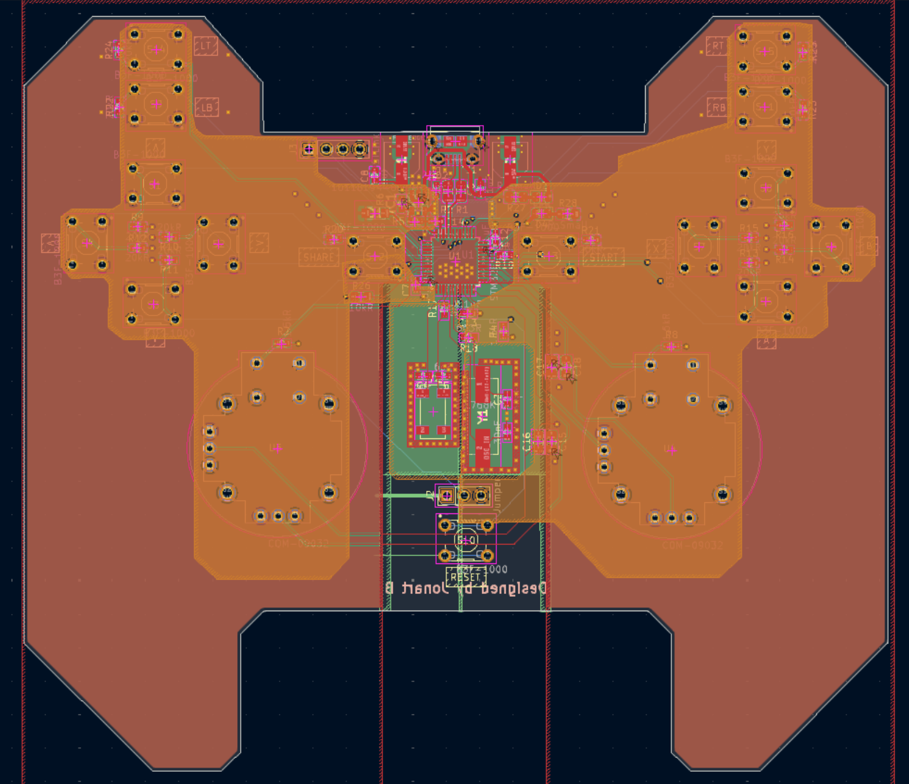

# hid-controller

A custom USB gamepad built on an STM32F103, with a KiCad PCB and STM32 firmware. It has two analog sticks with click switches, a D-pad, face buttons, bumpers, digital triggers and Start/Share buttons.



https://github.com/user-attachments/assets/c4e4d3e5-b4be-487b-b6eb-255510382f0a

## USB identity and compatibility

The device appears as **J-Controller**, with manufacturer **Jonart B** and VID:PID **1209:028e**. It sends custom HID gamepad reports. The controls follow an Xbox-style layout, but the firmware does not provide native XInput support.

Linux enumerates the controller. Windows only partly enumerates it so far. You can try [x360ce](https://www.x360ce.com/) for XInput mapping, but Windows needs to detect the controller first. There is no confirmed setup procedure for Windows yet.

## Files

| Path | Purpose |
| --- | --- |
| [hid-controller-pcb/](hid-controller-pcb/) | KiCad schematic, PCB, libraries and BOM |
| `hid-controller-pcb/production/hid-controller-pcb.zip` | Fabrication Gerbers |
| `hid-controller-code/hid-controller-code/` | Active firmware and Makefile |
| `Core/Src/main.c` inside the firmware folder | ADC sampling, button mapping and report updates |
| `USB_DEVICE/App/` inside the firmware folder | USB descriptors and HID interface |
| `usb-backup/` inside the firmware folder | Older firmware copy; not the Makefile's source tree |
| `assets/` | Photos, PCB layout and video |

## PCB and assembly

Open `hid-controller-pcb/hid-controller-pcb.kicad_pro` in KiCad. Review the schematic and layout before fabrication. The root board BOM is `hid-controller-pcb/BOM.csv`; production exports also include `production/bom.csv` and `production/positions.csv`. Match the BOM and placement export to the board revision you intend to assemble.



Use the schematic's **SWDIO**, **SWCLK** and ground nets for the ST-Link connection, together with target-voltage reference as required by your probe. Check the actual connector orientation against the schematic rather than assuming a standard header pin order.

## Build

Requires GNU make, Arm GNU tools (`arm-none-eabi-gcc`, `objcopy` and `size`, including the C library/nano specs), and a POSIX shell for Makefile commands. Flashing requires ST-Link and [STM32CubeProgrammer](https://www.st.com/en/development-tools/stm32cubeprog.html), with `STM32_Programmer_CLI` on PATH.

**NOTE:** The firmware folder contains both `STM32F103XX_FLASH.ld` and `STM32F103xx_FLASH.ld`. They collide on a normal Windows filesystem. Use a case-sensitive filesystem (for example, a clone inside WSL's Linux filesystem) so both files can be checked out. The Makefile selects `STM32F103xx_FLASH.ld`.

```sh
git clone https://github.com/elitetq/hid-controller.git
cd hid-controller/hid-controller-code/hid-controller-code
make clean
make
```

The compiler path defaults to `/usr/bin/`. If your toolchain is elsewhere:

```sh
make GCC_PATH=/path/to/arm-toolchain/bin
```

Or, if the Arm tools are already on PATH, use `make GCC_PATH=`. The output is `build/hid-controller-code.elf`, with `.hex` and `.bin` versions alongside it. Clean first so checked-in build artifacts are not reused. There is no specific compiler/programmer version recorded for this build.

## Flash

Connect ST-Link to the powered target with common ground. From the firmware folder:

```sh
STM32_Programmer_CLI -c port=SWD -w build/hid-controller-code.elf -v -rst
```

This writes the ELF, verifies it and resets the device. The Makefile's `make flash` target contains a machine-specific Windows programmer path; use the command above or override `STMJLINKPATH` with your programmer executable. If you build in WSL, make sure the programmer can access ST-Link. You can also copy the ELF to Windows and flash it with STM32CubeProgrammer there.

## Check the inputs

1. Connect the controller's USB data port to the host. On Linux, `lsusb -d 1209:028e` can check enumeration; then check the inputs separately.
2. Open a gamepad input viewer. On Windows, start with **Win+R > joy.cpl** if the device appears there.
3. Move both sticks through their range and back to center. Check the D-pad, face buttons, bumpers, Start/Share and both stick clicks individually.
4. Press and release each trigger. These are digital switches: the firmware maps each trigger to 0 or 255, not an analog pressure range.
5. If using x360ce, confirm it detects the source device before mapping controls to a virtual controller and testing in a game. Failure to enumerate must be solved before mapping can help.

If inputs are missing, compare `gamepad_update_buttons()` and `gamepad_update_joysticks()` in `Core/Src/main.c` with the schematic and the report descriptor in `USB_DEVICE/App/usbd_custom_hid_if.c`. The two stick axes are swapped/inverted in software. Check the inputs on the assembled controller, as enumeration alone does not confirm that the mappings work.
